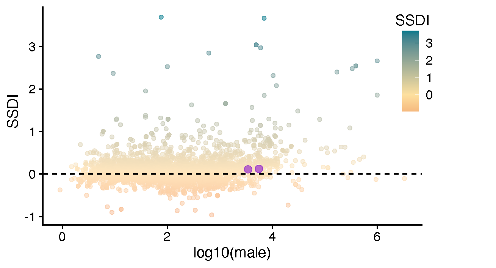

<!-- README.md is generated from README.Rmd. Please edit that file -->

```{r, include = FALSE}
knitr::opts_chunk$set(
  collapse = TRUE,
  comment = "#>"
)
```

# Macro_SSDI

<!-- badges: start -->
<!-- badges: end -->

The goal of Macro_SSDI is to ...




